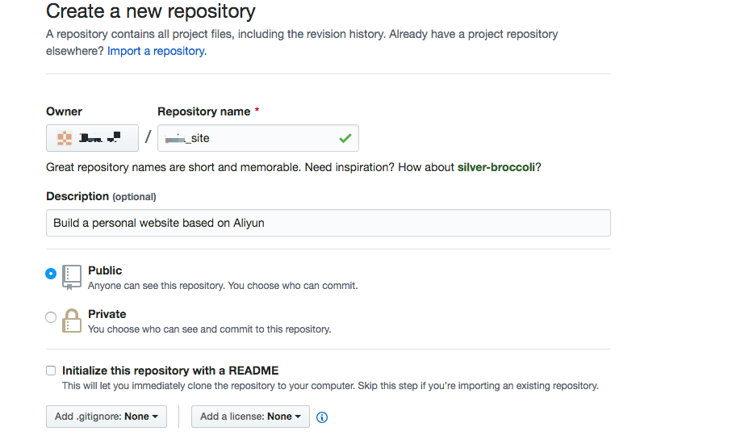

### 目标 

本地写完代码，直接提交到github上，并且自动同步到阿里云服务器。

### 1. 首先在github上新建一个项目，如图


### 2. 确保阿里云服务器上安装了git
```
    yum install git     // 使用yum安装git
```

### 3. 在阿里云服务器上配置自己的github用户名、邮箱
```
    git config --global user.name "your userName"
    git config --global user.email "your email"
```

### 4. 为了避免git pull时输入账户密码，创建.git-credentials
```
    cd ~
    vi .git-credentials


    // 在.git-credentials文件中写入以下信息 
    https://用户名:密码@github.com  // github的配置

```

